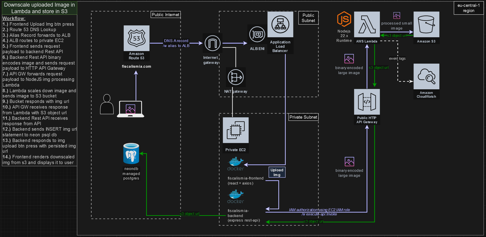
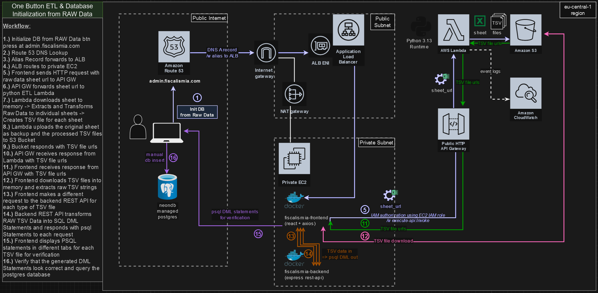

# aws_cert_coding

<b><u>Workflow:</u></b>

- Create AWS VPC resources (public & private subnet, Bastion Host & Private EC2 - ALB to Private EC2 - EIP - IGW/NAT GW)
- Setup DNS (subdomain & alias records for Domains -> ALB -> private EC2)
- (Optional) Create AWS IAM Organizational Units /w accounts / Resource Sharing of resources
- Create Lambda, Public HTTP API Gateway and S3 bucket for image upload & processing & storage

<details closed>
<summary><b>AWS EC2 - VPC - ALB - EIP - IGW/NAT GW</b></summary>


#### Architectural Overview
TODO

<u>Included Resources:</u>

- Single VPC with 1 public subnet and 2 private subnets (in 2 AZs)
- Public Subnet with NAT GW + IGW
- EC2 Bastion Host in Public Subnet
- EC2 private instance(s) in private subnet only reachable from ALB/Bastion Host
- ALB in public and private subnet (2 AZs) for accessing private EC2 instance
- Elastic IP for TODO
- TODO

### 1. Install EC2 Bastion Host, 1-n EC2 Instances, VPCs /w Private & Public Subnet, IGW, NAT GW, Elastic IP, Load Balancer for ingress to private EC2 etc.

#### a. Setup Environment Variables with your secrets and configuration
scaffold the .env files with the following script and fill in your own details.
```bash
cd scripts/ && ./setup-env-vars.sh
```

#### b. Associate SSH Key to Instance
Create Public/Private Key pair so ec2-instance can add the public key to its ssh_config or use an existing key pair.

#### c. Provide custom variables
Create `aws_cert_coding/aws_ec2_vpc_subnets/terraform/terraform.tfvars` file and change any desired variables by overwriting the default values within `variables.tf`
```bash
my_ips                      = ["81.xxx.xxx.231/32", "33.xxx.xxx.xxx/32"]
public_key_location         = "~/.ssh/id_ed25519.pub"
public_key_name             = "id_ed25519.pub"
private_key_location        = "~/.ssh/id_ed25519"
private_key_name            = "id_ed25519"
bastion_host_instance_type  = "t2.micro"
ec2_instance_type           = "t2.micro"
ec2_instance_count          = 1
```

#### d. Create S3 bucket to store terraform state to synchronize the state to remote storage as secure backup

See https://github.com/hangrybear666/12-devops-bootcamp__terraform
- Simply follow bonus step 3 to setup the s3 backend used in this project's `provider.tf` file (only required once for all states).
- Change bucket = "{YOUR_S3_UNIQUE_BUCKET_NAME}" in `provider.tf` that you've set in bonus project 3.

#### e. Setup Infrastructure

```bash
cd aws_ec2_vpc_subnets/terraform
source .env
terraform init
terraform apply --auto-approve
```

<b>Terraform logs the ssh command for bastion host and the private ec2 ip</b>

```bash
ssh -i ~/.ssh/id_ed25519 admin@PUBLIC_BASTION_IP
ssh -i ~/.ssh/id_ed25519 admin@PRIVATE_EC2_IP

# OR use transitive SSH Agent Port Forwarding
eval $(ssh-agent)
ssh-add ~/.ssh/id_ed25519
ssh -A admin@PUBLIC_BASTION_IP
ssh admin@PRIVATE_EC2_IP
```

<b>Follow the terraform output to provision the ec2-instances</b>

- Mounts Elastic File System Network drive to /mnt/nfs/ in bastion host and ec2-instances (dev-1 - dev-n)
- Installs git repo containing basic setup scripts for debian ec2 instances (.env file with credentials from step a) is provisioned via tf)
- configures swapfile so ec2 instance doesn't crash when RAM is fully allocated
- installs docker engine and adds as systemctl service
- starts an nginx docker container serving a static html file with dynamic ip and hostname information exposed later via load balancer

```bash
#   __   ___ ___       __             __  ___            __   ___
#  /__` |__   |  |  | |__)    | |\ | /__`  |   /\  |\ | /  ` |__
#  .__/ |___  |  \__/ |       | | \| .__/  |  /~~\ | \| \__, |___ [dev-1]

# bastion host
ssh -i ~/.ssh/id_ed25519 admin@3.126.9.131
bash /home/admin/mount_efs_drive.sh 10.0.2.6

# private ec2-instance dev-2
ssh -i ~/.ssh/id_ed25519 admin@10.0.2.31
bash /home/admin/mount_efs_drive.sh 10.0.2.6
bash /home/admin/install-git-on-debian-ec2.sh
cd /home/admin/git/ec2-debian-init/scripts/
sudo ./configure-ec2-swapfile.sh
bash install-docker-engine.sh
cd /home/admin/
bash expose_html_via_nginx.sh dev-1
sleep 5
echo "" && curl http://localhost
```

</details>

-----

<details closed>
<summary><b>AWS DNS via Route 53 over TLS</b></summary>


#### Architectural Overview
TODO

<u>Included Resources:</u>

- TODO

#### a. Register a Domain with Route 53 domain registrar

#### b. Provide custom variables
Create `aws_cert_coding/aws_route_53/terraform/terraform.tfvars` file and change any desired variables by overwriting the default values within `variables.tf`
```bash
domain_name      = "asd.com"
alb_arn          = "arn:aws:asdasd:eu-centrasdp/alb-asdasdasded33d3"
subdomain_list   = [ "api", "demo", "admin" ]
```

#### c. Create S3 bucket to store terraform state to synchronize the state to remote storage as secure backup

See https://github.com/hangrybear666/12-devops-bootcamp__terraform
- Simply follow bonus step 3 to setup the s3 backend used in this project's `provider.tf` file (only required once for all states).
- Change bucket = "{YOUR_S3_UNIQUE_BUCKET_NAME}" in `provider.tf` that you've set in bonus project 3.

#### d. Setup Infrastructure


<u>Included Resources:</u>

- TODO

```bash
cd aws_route_53/terraform/
terraform init
terraform apply --auto-approve
```
</details>

-----

<details closed>
<summary><b>AWS IAM, Organizationaand invoke functionl Units, Resource Access Mgr, Network & Dev Account</b></summary>

#### Architectural Overview
TODO

<u>Included Resources:</u>

- TODO

```bash
-----------------------------------------------
|           org/root                           |
| dev ou  | sandbox ou | prod ou | network ou  |
| dev_acc | tempdel ou |           network_acc |
|                                              |
-----------------------------------------------
```

#### 1. Create an organization in your root account and create a well Architected Multi Account Environment

- First Create Organization in AWS Console to be able to execute the terraform config
- Enable SCPs under AWS Organizations -> Policies -> Service control policies *Note: they don't apply to management acc/iam users of mgmt acc*
- Enable AWS Resource Explorer in AWS Console to find resources across your organization easily
- Enable AWS RAM (Resource Access Manager) in AWS Console to share resources between accounts on a high level.
- In Resource Access Manager Settings Enable Resource Sharing Across AWS Organizations

```bash
cd aws_iam/terraform
terraform init
terraform apply --auto-approve
```

*Notes:*
- The dev VPC and Subnet created by aws_ec2_vpc_subnets is shared across the organization via RAM

**To access EC2 instances of the admin account:**
- Then login to dev account using credentials provided by
- In the Switch Role dialog:
- **Account ID**: Enter the Account ID of your admin account
- - **Role Name**: Enter `EC2FullAccessRole`

</details>

-----
<details closed>
<summary><b>AWS Serverless (Lambda, API Gateway) and S3 storage</b></summary>

### Theory

#### Anti-Patterns

- Chaining 2-n Lambda functions synchronously (where the first function waits for the last function to return) creates exponentially overlapping costs
- Breaking the single responsibility principle of a lambda function makes it difficult to monitor, optimize and debug a function and might create additional costs due to autoscaling to the level of the most demanding task

#### Best Practices

- Use step functions instead of synchronous lambda functions to construct an event flow, branching paths, error handling, retries and fallbacks
- When integrating with SQS use batch processing with x seconds wait window after queueing a message to collect multiple messages at once to avoid spamming lambda invocations (Optionally enable lambda to report failed message IDs in the batch to avoid reprocessing the entire batch)

#### Architectural Overview



<u>Included Resources:</u>

- API HTTP Gateway that can invoke Lambda functions
- 2 Lambda Functions for Img Upload and Google Sheets Raw Data ETL
- 2 Lambda Layers containing the runtime dependencies not included in aws by default
- 2 S3 Buckets accessed by Lambda for storing processed images and sheet output
- Respective IAM Roles and Permissions to allow access between API GW - Lambda - S3

#### 1. Provide custom variables
Create `aws_cert_coding/aws_serverless_and_s3/terraform/terraform.tfvars` file and change any desired variables by overwriting the default values within `variables.tf`
```bash
secret_api_key = "xxx"
test_sheet_url = "https://docs.google.com/spreadsheets/d/{YOUR_ID}/edit"
```

#### 2. Make changes to your lambda functions and provision the resources

```bash
cd aws_serverless_and_s3/terraform/ && terraform init
terraform apply --auto-approve
```

</details>

-----